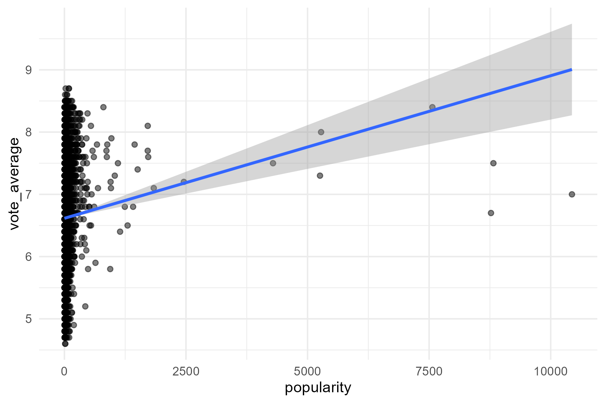
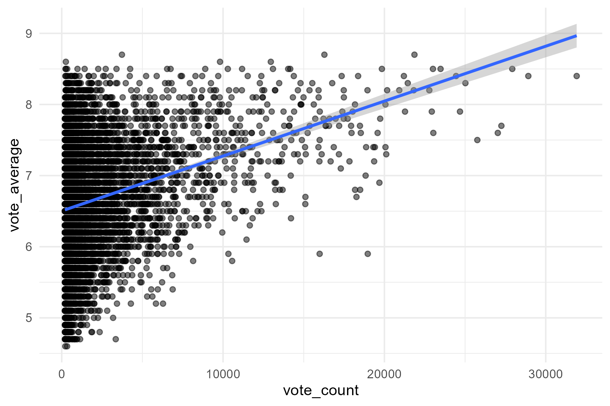
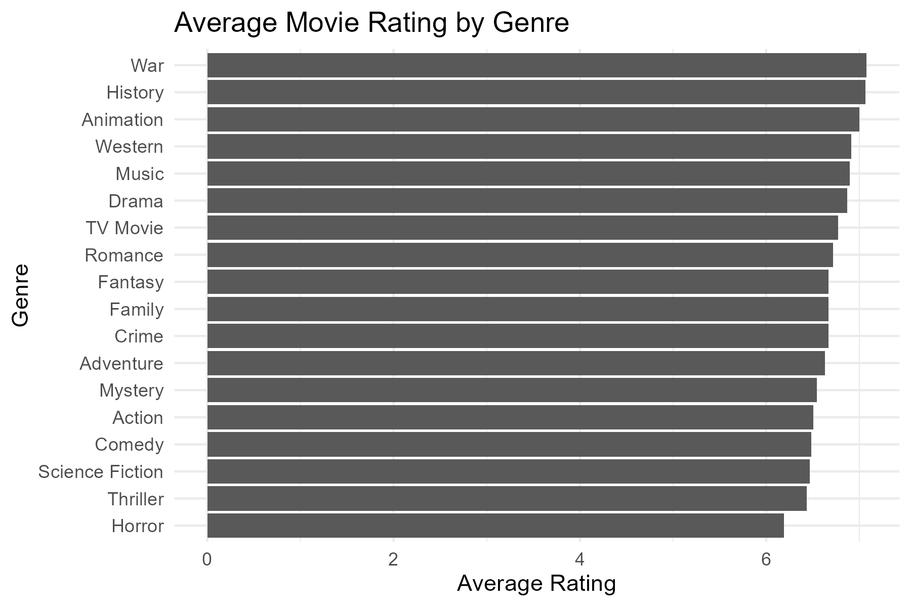

# Movie Rating Analysis

## Apakah Popularitas Menentukan Kualitas Film?

---

## Latar Belakang

Banyak orang memilih film berdasarkan popularitas. Film yang trending sering dianggap memiliki kualitas yang lebih baik. Namun, apakah benar popularitas mencerminkan kualitas film? Project ini mencoba menjawab pertanyaan tersebut menggunakan pendekatan data.

---

## Tujuan

* Menganalisis hubungan antara **popularity** dan **rating film**
* Menganalisis hubungan antara **vote count** dan **rating**
* Mengidentifikasi faktor yang lebih berpengaruh terhadap rating (genre)

---

## 📊 Dataset

Dataset berasal dari TMDB Movies Dataset (~10.000 film), dengan variabel utama:

* `popularity`
* `vote_count`
* `vote_average`
* `genre`

---

## Data Cleaning

Langkah yang dilakukan:

* Mengecek missing value
* Memastikan tipe data numerik
* Membersihkan data yang tidak relevan
* Memproses kolom genre menjadi format analisis

---

## Analisis

---

## 📈 Popularity vs Rating



**Insight:**

* Korelasi ≈ **0.063**
* Hubungan sangat lemah

👉 Popularitas hampir tidak berpengaruh terhadap rating film.

---

## 📈 Vote Count vs Rating



**Insight:**

* Korelasi ≈ **0.267**
* Hubungan lebih kuat dibanding popularity, namun masih lemah

👉 Jumlah vote sedikit berpengaruh terhadap rating, tetapi bukan faktor utama

---

## Modeling

Model regresi linear digunakan:

```
vote_average ~ popularity + vote_count
```

**Hasil:**

* R² ≈ **0.004**
* Signifikan secara statistik, namun kontribusi sangat kecil

👉 Model tidak mampu menjelaskan rating dengan baik

---

## Genre Analysis (Key Insight)



### Genre dengan rating tertinggi:

* War
* History
* Animation
* Drama

### Genre dengan rating terendah:

* Horror
* Thriller
* Science Fiction
* Comedy

---

## Insight Utama

* Popularity tidak berpengaruh signifikan terhadap rating
* Vote count memiliki pengaruh kecil
* **Genre memiliki pengaruh paling jelas terhadap rating film**

👉 Hal tersebut menunjukkan bahwa kualitas film lebih dipengaruhi oleh jenis konten dibanding popularitasnya

---

## Kesimpulan

Berdasarkan analisis:

> Popularitas bukan indikator utama kualitas film

Sebaliknya, **genre merupakan faktor yang lebih berpengaruh dalam menentukan rating film**.

---

## 💻 Tools

* R
* ggplot2
* dplyr
* tidyr

---

## Catatan

Dataset tidak disertakan dalam repository.
Silakan download dari sumber publik (Kaggle / TMDB), lalu jalankan kode yang tersedia.
